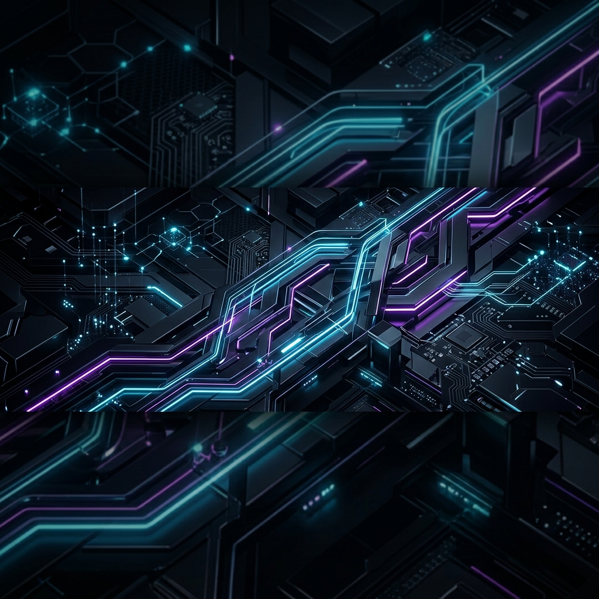

  
  
  <h1>🚀 JAMES KHELE</h1>
  <h3>Computer Science Engineer | AI Architect | Full-Stack Engineer</h3>

  

    
    
    
  

  

    ✨ <i>Pushing the frontiers of Edge AI, spatial intelligence, and distributed neural compute architectures.</i> ✨
  

 

## 🌠 Neural Nexus: Featured Ecosystems

### 🛸 Flagship Platform: CognitiveMesh-Orchestrator

 
Enterprise-grade distributed backend platform designed for high-throughput multi-agent dispatch, RAG pipelines, and asynchronous task coordination. Optimized with robust decoupled clean architecture, Docker container topology, and Redis caching locking layers.
  

### 🧪 Experimental Labs

| 🌌 NeuroStream-AI | 🌐 AetherNexus-AGI |
| :--- | :--- |
|  |  |
| Real-time, high-fidelity spatial edge telemetry utilizing device-native TensorFlow / MediaPipe compute channels. | Interactive canvas-driven dynamic graph simulator charting multi-node synaptic relay and vector density gradients. |

 

## ⚡ Protocol Overview

- 🔭 **Current Directive:** Developing hyper-scalable real-time backend infrastructures and distributed edge-AI nodes.
- 🧠 **Research Matrix:** Advanced Neural Engineering, Graph Physics Simulators, Real-time Computer Vision.
- ⚙️ **Tech Core:** Crafting resilient, reactive components built on robust database consistency models.
- ⚡ **Operational Metric:** Combining high-level engineering with systematic optimization for low-latency deployments.

 

## 🧰 Tech Stack & Weaponry

<b>🧠 AI & Data Science</b>

 

<b>🛠️ Core Engineering</b>

 

<b>💾 Infrastructure & Web</b>

 

 

## 📊 Quantum Diagnostics

  
  

  

 

  

---

  <i>Uplink Established. Data Stream Encrypted.</i>

